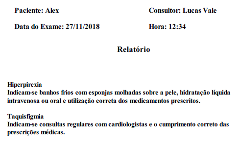
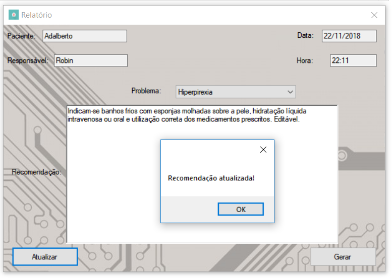

# health-diagnosis

Health Diagnostic System

## Pré-requisitos

* [.NET Core SDK](https://dotnet.microsoft.com/download)

## Amostra de imagens

Menu

Cadastro de um paciente

Criando uma consulta

Exemplo de relatório gerado

Edição de relatório

Exibindo histórico médico

