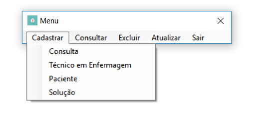
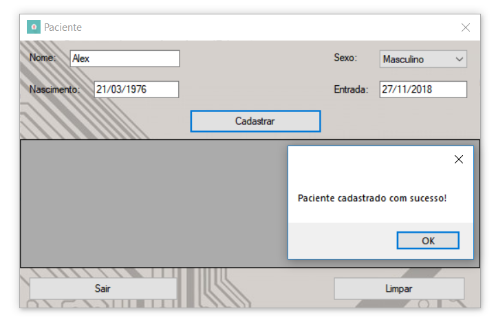
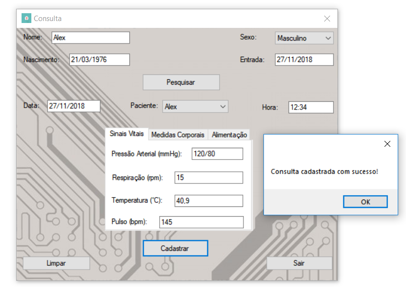
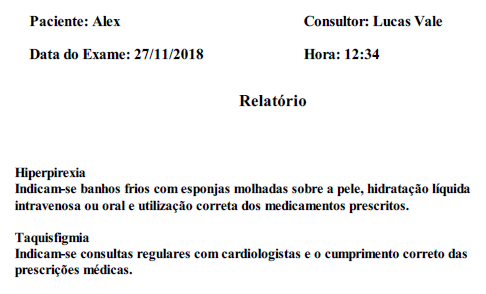
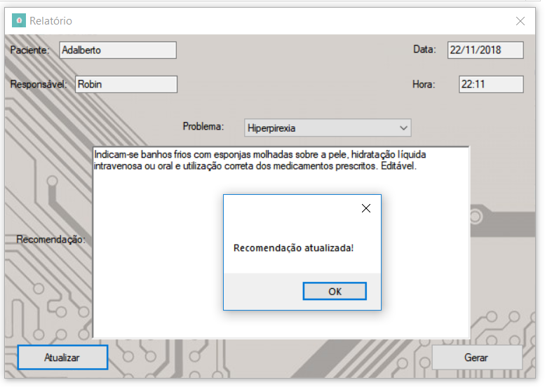
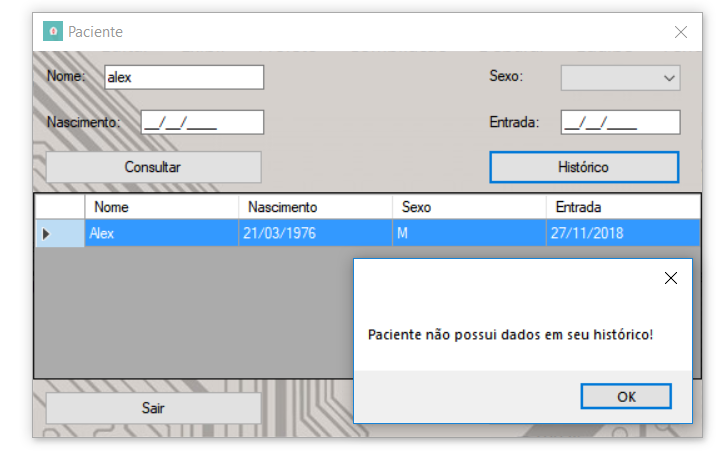
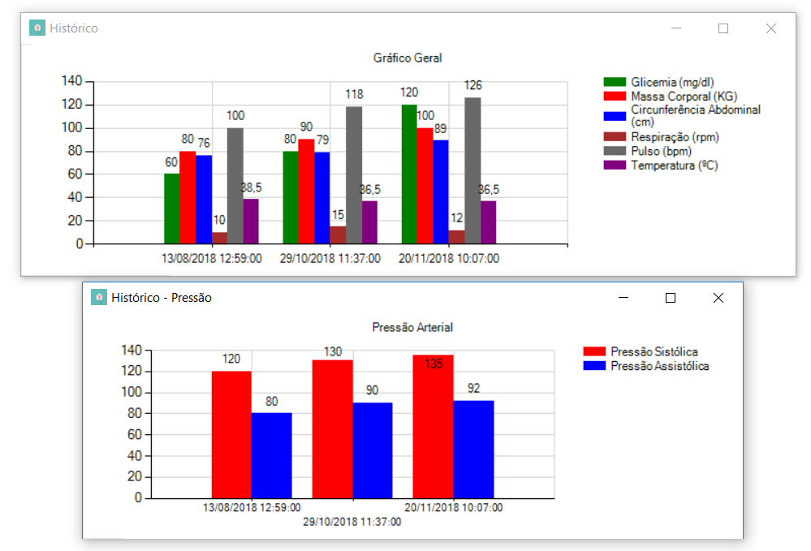

# Health-Diagnosis

Este projeto é um sistema de diagnóstico médico, que tem como propósito atender enfermeiros que precisam de uma ferramenta
para automatizar a classficação de risco de pacientes, criação de histórico médico, cadastro de consultas e
dentre outras tarefas.

## Guia de instalação

[Instalação](/installing.html)

## Amostra de imagens

Menu

Cadastro de um paciente

Criando uma consulta

Exemplo de relatório gerado

Edição de relatório

Exibindo histórico médico

